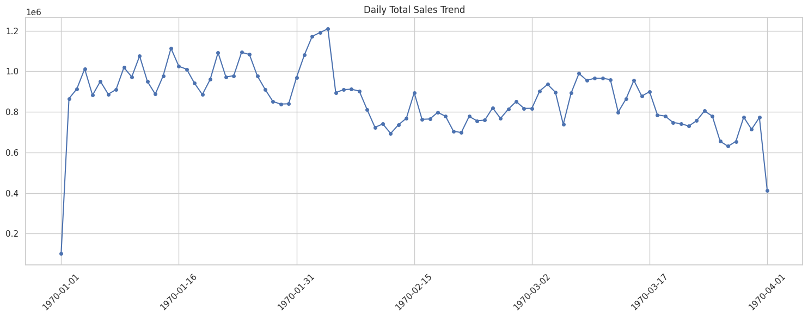

# Amazon Sales Data Analysis and Big Data Processing (PySpark)

This project demonstrates **Big Data** concepts and **Apache Spark (PySpark)** capabilities using Amazon sales data. The notebook covers data analysis, MapReduce logic, RDD vs DataFrame comparisons, Spark SQL queries, and real-time data streaming simulations.

## 📂 Project Structure

The project follows these steps in the `amazon_sales_v2.ipynb` file:

### 1. Data Loading and Inspection (Volume, Velocity, Variety)
*   Loading the `Amazon Sale Report.csv` dataset.
*   Analyzing row and column counts (Volume).
*    inspecting data types (Variety).
*   Observing data flow speed by checking the date range (Velocity).
*   **Data Cleaning**: Handling missing values for `Amount`, `Order ID`, etc.
*   **Feature Engineering**: Extracting `Month` and `Day Name` from dates.

### 2. Hadoop & MapReduce Simulation
*   Simulating MapReduce logic using PySpark.
*   Example: Calculating total sales amount for each category.

### 3. RDD vs DataFrame Comparison
*   Performing the same operation (e.g., total sales by category) using both **RDD (Resilient Distributed Dataset)** and **DataFrame** APIs.
*   Demonstrating memory optimization techniques (`.cache()`, `.persist()`).

### 4. Spark SQL Analysis
Converting the DataFrame into a temporary SQL view (`amazon_sales`) and running the following SQL queries:
*   Total sales amount based on category.
*   The state with the highest sales.
*   Percentage of "Cancelled" orders.

### 5. Spark Streaming
*   Creating a folder (`stream_input_folder`) to simulate real-time data flow.
*   Listening to this folder and processing new incoming data instantly to update category-based sales totals.

### 6. Advanced Visualization & Conclusion
*   Bar Chart: Total Sales by Category.
*   Pie Chart: Order Status Distribution.
*   Final project conclusion and insights.

## 🛠 Requirements

To run this project, you need the following technologies:

*   **Python**
*   **Apache Spark** (PySpark)
*   **Jupyter Notebook** or **Google Colab**
*   Helper libraries: `pandas`, `matplotlib`, `seaborn`

## 🚀 Installation and Execution

1.  Clone this repo or download the files.
2.  Ensure PySpark is installed in your environment (Local or Colab).
3.  Open the `amazon_sales.ipynb` file.
4.  Make sure to update the path of the dataset (`Amazon Sale Report.csv`) according to your environment (The notebook uses `/content/drive/...`, change this to your local path if running locally).
5.  Run the cells sequentially to view the analyses.

## 📊 Dataset
The dataset used in this analysis contains over 128,000 rows of Amazon India sales data. 

- **Source:** You can download the dataset from Kaggle: [Amazon Sales Report Dataset](https://www.kaggle.com/datasets/mdsazzatsardar/amazonsalesreport)
- **Size:** ~128k rows and 24 columns.
- **Note:** Due to GitHub's file size limits, the raw CSV file is not included in this repository. To run the notebook, please download the CSV from the link above and place it in the `/data` directory.
